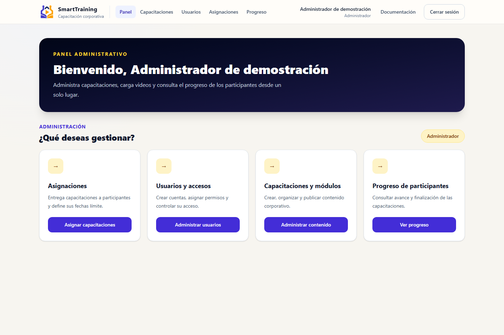
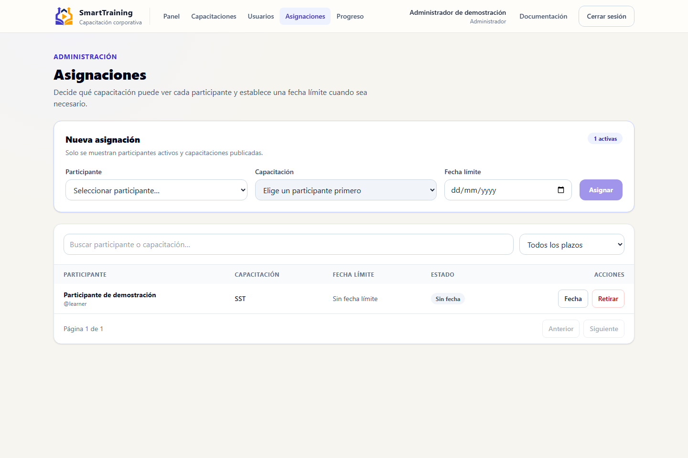
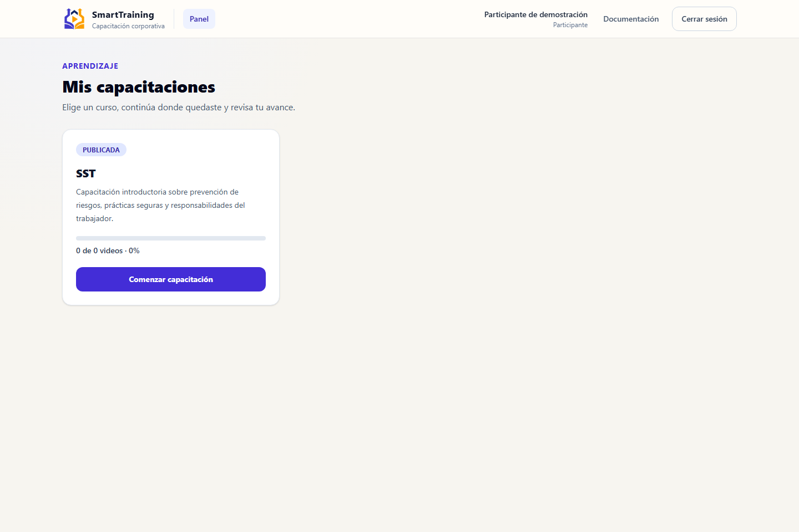
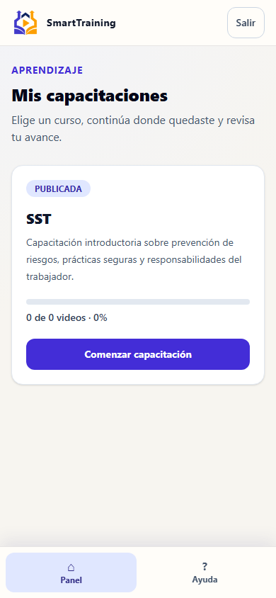
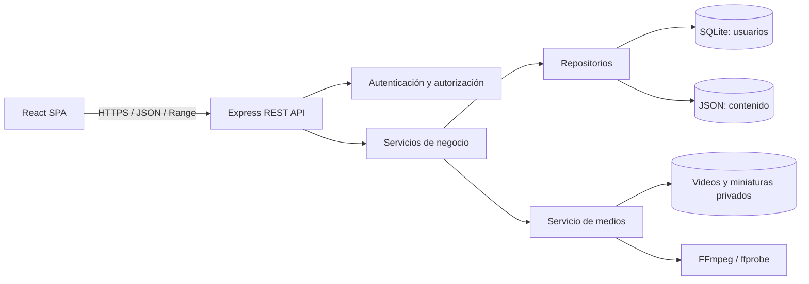

# SmartTraining

[](https://github.com/dafermen/SmartTraining/actions/workflows/ci.yml)
[](https://nodejs.org/)
[](LICENSE)

SmartTraining es una plataforma web para crear, asignar, administrar y consumir capacitaciones corporativas basadas en video. El MVP integra una SPA React responsive, una API Express, control de acceso por roles, persistencia SQLite/JSON, procesamiento de medios y seguimiento de progreso.

> Estado: **candidato de release**. Consulte [CURRENT_STATUS.md](CURRENT_STATUS.md) antes de continuar el desarrollo o desplegar.

## Objetivo

Permitir que administradores publiquen capacitaciones organizadas en módulos y videos, y que participantes consuman el contenido con seguimiento de progreso y reanudación de reproducción.

## Vista de la aplicación

| Panel administrativo                                                      | Asignación de capacitaciones                                         |
| ------------------------------------------------------------------------- | -------------------------------------------------------------------- |
|  |  |

| Catálogo del participante                                                       | Experiencia móvil                                                     |
| ------------------------------------------------------------------------------- | --------------------------------------------------------------------- |
|  |  |

Las imágenes se generan desde la aplicación local con cuentas demo, sin mostrar contraseñas, tokens ni datos personales:

```bash
npm run dev:5175
npm run docs:screenshots
```

## Tecnologías

- Frontend: React, TypeScript, Vite, React Router, Tailwind CSS y Axios.
- Backend: Node.js, TypeScript, Express, Zod, JWT, bcrypt, Multer y FFmpeg.
- Persistencia: SQLite para identidades, asignaciones y auditoría; JSON atómico para contenido y progreso.
- Pruebas: Vitest, React Testing Library y Supertest.

## Arquitectura



Consulte [Arquitectura](docs/04-architecture.md), [estructura](docs/05-folder-structure.md) y [seguridad](docs/10-security.md).

## Características del MVP

- Autenticación JWT y autorización por roles `ADMIN` y `LEARNER`.
- Administración de usuarios, roles, estado, contraseñas y auditoría de accesos.
- Asignación individual de capacitaciones publicadas con fechas límite opcionales y conservación del progreso al retirar acceso.
- CRUD, publicación y ordenamiento de capacitaciones, módulos y videos.
- Carga validada, miniatura automática y streaming protegido con HTTP Range.
- Progreso por video, finalización al 80 % y reanudación.
- Reinicio administrativo del progreso de un video para un participante, con auditoría.
- Documentación Markdown dentro de la aplicación, con búsqueda y acceso por rol.
- Tablero de fases y tareas administrable.

## Requisitos

- Node.js 24.15 o superior y npm 10 o superior.
- Los binarios locales de FFmpeg y ffprobe se instalan con el backend; las rutas de entorno permiten reemplazarlos.
- Espacio local suficiente para los videos del entorno de demostración.

## Instalación y ejecución

Instale las dependencias y prepare los datos demo:

```bash
npm install
npm install --prefix backend
npm install --prefix frontend
Copy-Item backend/.env.example backend/.env
npm run seed
npm run dev
```

El archivo `.env` es opcional en desarrollo porque existen valores seguros de arranque local; créelo para personalizar puertos o secretos. Consulte [guía de instalación](docs/06-installation-guide.md).

## Configuración

Copie `.env.example` a `backend/.env` y reemplace `JWT_SECRET`. Nunca confirme `.env` en Git. Consulte [configuración](docs/07-configuration-guide.md).

## Usuarios de demostración

Después de ejecutar el seed se garantizan dos usuarios, una capacitación corporativa publicada, tres módulos y la asignación de esa capacitación a `learner`. Puede ejecutarse nuevamente sin duplicar esos registros ni eliminar contenido existente.

| Rol           | Usuario   | Contraseña exclusiva de demo |
| ------------- | --------- | ---------------------------- |
| Administrador | `admin`   | `comillas22`                 |
| Participante  | `learner` | `comillas22`                 |

La contraseña se almacenará solamente como hash bcrypt.

Abra `http://127.0.0.1:5173/login` después de ejecutar `npm run dev`. La sesión usa el JWT de la pestaña y una cookie `HttpOnly` para el streaming nativo protegido; consulte las limitaciones en la documentación de seguridad.

Después de iniciar sesión:

- `ADMIN`: panel en `/admin`, contenido en `/admin/content`, usuarios en `/admin/users`, asignaciones en `/admin/assignments` y progreso en `/admin/progress`.
- `LEARNER`: catálogo en `/learn`; desde allí abre el curso y reproduce sus videos.
- Ambos roles: centro de conocimiento en `/docs` con contenido autorizado. La ruta histórica `/documentation` redirige a la nueva ubicación.

## Estructura

```text
SmartTraining/
├── .github/           # CI y plantillas de colaboración
├── frontend/          # SPA React
├── backend/           # API, datos demo y medios privados
├── docs/              # Documentación numerada, índices estándar y ADR
├── test/              # Clasificación y evidencia central de pruebas
├── deploy/            # Nginx, systemd y guía de Ubuntu
├── AGENTS.md          # Reglas de continuidad para asistentes de desarrollo
├── CURRENT_STATUS.md
├── .env.example
└── package.json       # Orquestación del monorepo
```

## Scripts

- `npm run dev`: frontend y backend en paralelo.
- `npm run dev:5175`: frontend y backend en paralelo, con la interfaz en `http://127.0.0.1:5175`.
- `npm run build`: compilación completa.
- `npm test`: pruebas de ambos proyectos.
- `npm run test:properties`: propiedades e invariantes generativos del backend.
- `npm run test:e2e`: recorridos Playwright en escritorio y móvil.
- `npm run docs:check`: estructura documental y enlaces relativos.
- `npm run docs:screenshots`: regenera capturas reales contra la aplicación local en el puerto 5175.
- `npm run lint`: lint de ambos proyectos.
- `npm run verify`: lint, regresión completa y build.
- `npm run predeploy:core`: verificaciones automatizadas, contrato, seguridad, propiedades, E2E y auditoría de dependencias.
- `npm run seed`: usuarios, capacitación y módulos de demostración idempotentes.

Los scripts están operativos desde la Fase 2.

## API y documentación

El contrato inicial está en [documentación de API](docs/08-api-documentation.md). El índice completo está en [docs/README.md](docs/README.md).

Los puntos de entrada estándar son [arquitectura](docs/ARCHITECTURE.md), [API](docs/API.md), [desarrollo](docs/DEVELOPMENT.md), [pruebas](docs/TESTING.md), [despliegue](docs/DEPLOYMENT.md), [operaciones](docs/OPERATIONS.md), [seguridad](docs/SECURITY.md) y [troubleshooting](docs/TROUBLESHOOTING.md).

Antes de cualquier despliegue se deben registrar las trece puertas de prueba definidas en [docs/TESTING.md](docs/TESTING.md). `predeploy:core` no sustituye las validaciones manuales ni las herramientas todavía pendientes.

## Roadmap y limitaciones

El MVP usa disco local, SQLite y JSON: no ofrece escalado horizontal ni procesamiento distribuido. Consulte [roadmap](docs/19-roadmap.md) y [riesgos](docs/22-risks-and-limitations.md).

## Contribuir, seguridad y licencia

Consulte [CONTRIBUTING.md](CONTRIBUTING.md), [SECURITY.md](SECURITY.md), [LICENSE](LICENSE) y [THIRD_PARTY_LICENSES.md](THIRD_PARTY_LICENSES.md).

El estado de continuidad y los próximos pasos se mantienen en [CURRENT_STATUS.md](CURRENT_STATUS.md).

## DOC-STD-20261002 — Navegación documental

Consultar el [mapa documental](docs/README.md) para encontrar fuentes oficiales, rutas de lectura y reglas de mantenimiento del proyecto.
