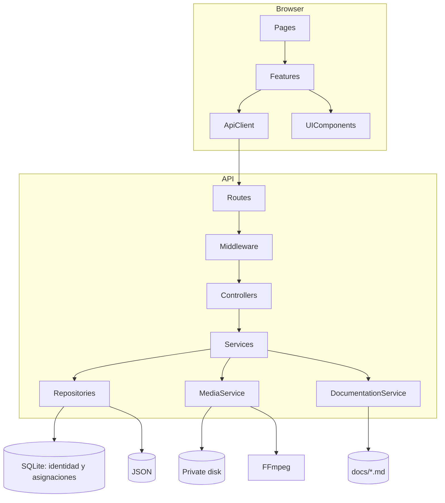

# Arquitectura propuesta

## Estilo

Monorepo con SPA React y API REST Express. El backend usa capas `routes → controllers → services → repositories`. Los servicios de medios y documentación son adaptadores de infraestructura.

## Responsabilidades

- **Rutas:** composición de middleware y controladores.
- **Controladores:** traducen HTTP; no contienen persistencia ni reglas extensas.
- **Servicios:** permisos de recurso, reglas, cascadas y transacciones compensatorias.
- **Repositorios:** contratos por entidad; SQLite para identidad/asignaciones y JSON para contenido.
- **JsonStore:** bloqueo por archivo, validación, backup y reemplazo atómico.
- **UserRepository:** esquema SQLite estricto, sentencias preparadas, transacciones y auditoría.
- **AssignmentRepository:** relación única participante-capacitación, vencimientos y auditoría en el mismo archivo SQLite privado.
- **MediaService:** nombres internos, límites, ffprobe/FFmpeg, borrado y streaming.
- **Frontend features:** API, tipos, componentes y hooks por dominio.

## Decisiones arquitectónicas

### ADR-001: monorepo npm simple

- Problema: coordinar dos aplicaciones y documentación con baja barrera de entrada.
- Alternativa: workspaces/Turborepo.
- Elección: scripts raíz con prefijos; es más explícito para estudiantes.
- Limitación: menos caché y automatización a gran escala.

### ADR-002: servicios y repositorios

- Problema: permitir reemplazar JSON sin reescribir reglas.
- Alternativa: controladores accediendo directamente a archivos.
- Elección: interfaces de repositorio inyectables y servicios de negocio.
- Limitación: más archivos y conceptos en un MVP.

### ADR-003: procesamiento asíncrono local

- Problema: FFmpeg puede tardar más que una petición HTTP.
- Alternativa: procesar y bloquear la respuesta de carga.
- Elección: responder `202` con estado `PROCESSING` y ejecutar una cola local limitada.
- Limitación: un reinicio exige reconciliar registros `PROCESSING`; no sustituye una cola durable.

### ADR-004: JWT Bearer y cookie protegida para medios

- Problema: autenticación simple entre puertos de desarrollo.
- Alternativa: colocar el token en la URL del video o descargar el archivo completo como Blob.
- Elección: Bearer en `sessionStorage` para llamadas Axios y cookie `HttpOnly`, `SameSite=Lax` para solicitudes nativas de video y miniatura.
- Limitación: XSS todavía puede exponer el Bearer de la pestaña; un despliegue entre sitios distintos deberá añadir protección CSRF y revisar `SameSite`.

### ADR-005: Markdown local con catálogo por rol

- Problema: consultar documentación desde la aplicación sin exponer todo el sistema de archivos.
- Alternativa: servir `docs` estáticamente o guardar Markdown en JSON.
- Elección: descubrir sólo archivos `NN-slug.md`, devolver contenido mediante API autenticada y filtrar antes de leer según el rol.
- Limitación: la audiencia de participante es una política explícita en código; un documento nuevo es administrativo hasta que se revise esa política.

## Dependencias dirigidas

Los tipos de dominio no importan Express, Multer ni `fs`. Los repositorios implementan contratos consumidos por servicios. Esto deja abiertas base de datos, almacenamiento de objetos y workers futuros.
