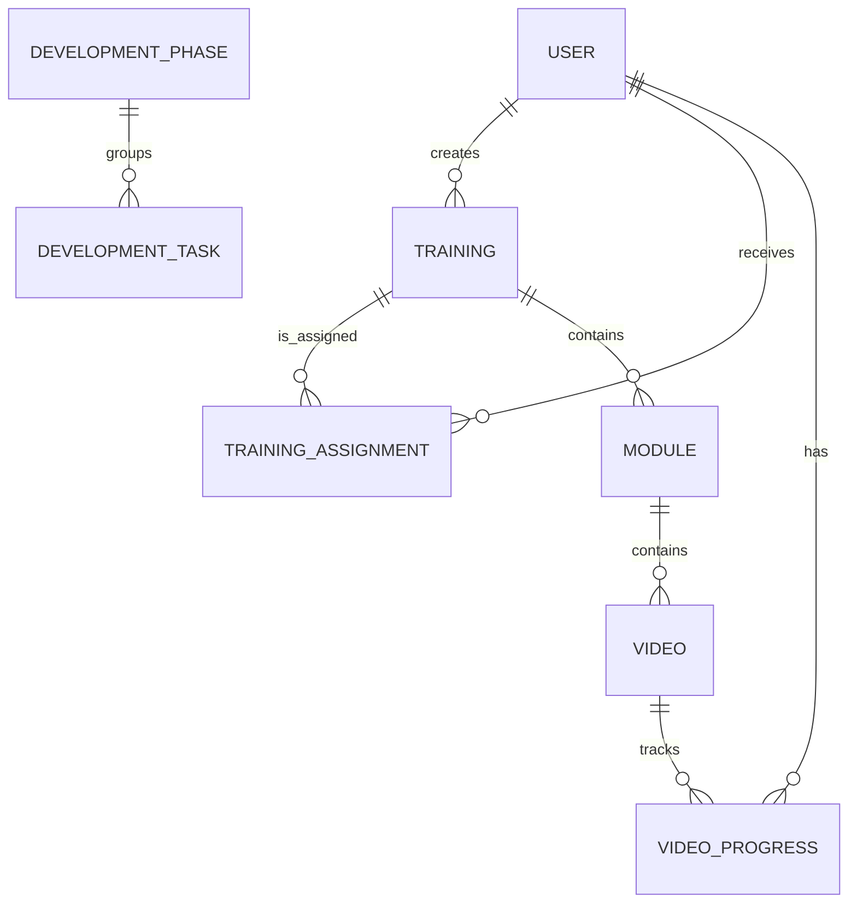

# Modelo de datos SQLite y JSON

Las identidades y su auditoría se almacenan en SQLite. El contenido conserva arreglos JSON validados al leer y antes de escribir. Identificadores nuevos: UUID v4; fechas: ISO 8601 UTC; órdenes: enteros no negativos únicos dentro del padre.

## Entidades

`User` contiene `id`, `username`, `passwordHash`, `role`, `displayName`, `active`, `authVersion`, `createdAt` y `updatedAt`. El hash y la versión de sesión nunca se envían al cliente.

`TrainingAssignment` contiene `id`, `userId`, `trainingId`, `assignedBy`, `assignedAt`, `dueDate` opcional y `updatedAt`. La fecha límite es una fecha civil `YYYY-MM-DD`; el estado vencida/próxima/en plazo se deriva en la interfaz.

`TrainingVideo.processingError` es opcional: aparece cuando el procesamiento termina en `ERROR`, se elimina al iniciar un reintento y no contiene rutas físicas ni comandos internos.

## Archivos

| Archivo                   | Contenido                           | Relaciones mantenidas               |
| ------------------------- | ----------------------------------- | ----------------------------------- |
| `users.sqlite`            | usuarios, asignaciones y auditoría  | `createdBy`, `uploadedBy`, progreso |
| `trainings.json`          | capacitaciones                      | `moduleIds` ordenados               |
| `modules.json`            | módulos                             | `trainingId`, `videoIds` ordenados  |
| `videos.json`             | metadatos, nunca rutas absolutas    | `moduleId`                          |
| `progress.json`           | un registro por `(userId, videoId)` | training/module/video coherentes    |
| `development-phases.json` | fases                               | orden y estado                      |
| `development-tasks.json`  | tareas                              | fase y dependencias válidas         |

## Invariantes

- Una referencia debe existir y pertenecer al mismo árbol.
- Un LEARNER solamente accede a contenido `PUBLISHED` que tenga asignado y a sus videos `READY`.
- Solo un usuario activo con rol `LEARNER` puede recibir una asignación; `(userId, trainingId)` es único.
- `currentTime >= 0`, `duration > 0`, `currentTime <= duration + tolerancia`.
- El porcentaje efectivo se recalcula en backend y se limita a 0–100.
- `COMPLETED` no retrocede por una actualización posterior menor.

## Persistencia segura

SQLite utiliza tablas `STRICT`, claves y restricciones, consultas parametrizadas, transacciones, WAL, `foreign_keys`, modo defensivo y extensiones deshabilitadas. `user_audit_log` registra creación, cambios de acceso y restablecimiento de claves; `assignment_audit_log` registra asignación, cambio de vencimiento y retiro. No existe borrado de usuarios: se desactivan para conservar sus referencias e historial.

Cada mutación de contenido adquiere un mutex por archivo, relee/valida, escribe `archivo.tmp`, relee/verifica, copia el anterior a `.bak` y reemplaza mediante rename. Las operaciones entre varios JSON usan un mutex de unidad de trabajo y compensación documentada; no son transacciones ACID.

Si `users.sqlite` aún no existe o está vacío, el repositorio importa una sola vez el antiguo `users.json`. Después de migrar, SQLite es la fuente de verdad y el JSON de usuarios no debe restaurarse sobre ella.

Al detectar corrupción: se detienen escrituras, se registra el error, se intenta validar `.bak` y la restauración requiere una acción explícita del operador.
