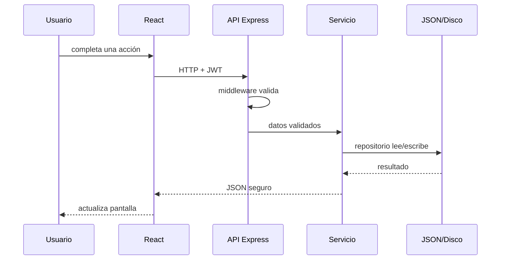

# Guía para estudiantes

Una aplicación **full stack** combina interfaz y servidor. React construye la interfaz con componentes; TypeScript comprueba tipos; Node.js ejecuta JavaScript/TypeScript en servidor; Express organiza HTTP. Una API REST expone recursos mediante rutas y verbos. JSON representa datos con objetos y arreglos.

JWT es un comprobante firmado de sesión. Un middleware revisa ese comprobante antes del controlador. El controlador traduce HTTP, el servicio aplica reglas y el repositorio oculta cómo se guardan datos. Una interfaz TypeScript describe una forma; un componente React describe una parte de UI; una ruta protegida exige sesión/rol.

En una carga, Multer recibe partes del formulario, valida límites y asigna un nombre interno; FFmpeg analiza el video y crea miniatura. En streaming, el navegador pide un rango de bytes y el servidor transmite solo ese tramo. El progreso envía posición y duración cada cierto intervalo; el backend recalcula porcentaje y finalización.

Para estudiar: (1) lea visión y glosario, (2) explore tipos, (3) siga login, (4) siga listado de capacitaciones, (5) siga carga/streaming, (6) siga progreso, (7) ejecute pruebas, (8) implemente un cambio pequeño documentado.
