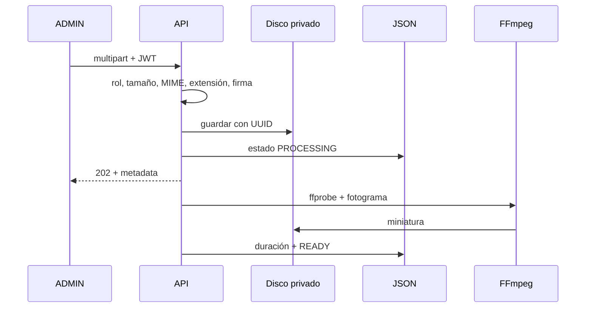

# Diseño de almacenamiento y streaming de video

## Carga y procesamiento

El archivo temporal se crea dentro de una raíz controlada. Tras validar se mueve a `storage/videos` con nombre UUID y extensión normalizada. La miniatura usa UUID distinto en `storage/thumbnails`. JSON guarda nombres, no rutas absolutas.

El backend usa binarios FFmpeg/ffprobe empaquetados como dependencias para que el desarrollo sea reproducible. `FFMPEG_PATH` y `FFPROBE_PATH` tienen prioridad cuando se requieren binarios corporativos actualizados o administrados por el operador.

El fotograma se toma en `min(5, max(0, duration * 0.5))` segundos, evitando solicitar un instante fuera del video. Un fallo limpia resultados parciales, conserva el archivo original, deja el estado `ERROR` y guarda un mensaje seguro en `processingError`. El ADMIN puede iniciar `POST /videos/:id/retry`; la API limpia el error, vuelve a `PROCESSING` y reutiliza el archivo almacenado.

## Streaming protegido

1. Autenticar y localizar video por UUID.
2. Autorizar: ADMIN o LEARNER con capacitación publicada; exigir `READY`.
3. Derivar/validar ruta desde nombre interno y raíz real.
4. Obtener tamaño, parsear un solo `Range` y rechazar rangos inválidos.
5. Enviar headers y `createReadStream({start,end})`; observar desconexión.

La alternativa de URL firmada/CDN se descarta para el disco local del MVP. La limitación es que cada byte pasa por la API y un usuario autorizado puede conservarlo.

## Eliminación

El servicio bloquea el árbol, construye un inventario, actualiza registros mediante unidad de trabajo y elimina archivos de forma idempotente. Si falla un archivo, registra una tarea de reconciliación; nunca concatena entradas del usuario a una ruta.
